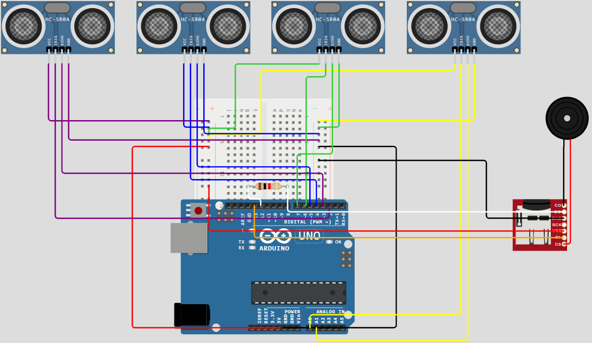
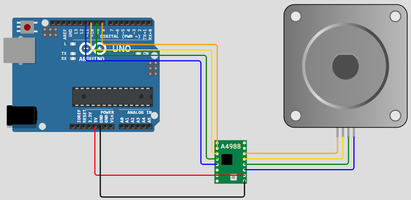

# Tocadiscos Automatizado - Grupo 4 (SEyTR)  
## ¿Qué hicimos?
Este proyecto consiste en la creación de un tocadiscos interactivo y automatizado que transforma objetos físicos en secuencias musicales.

El sistema utiliza un gran disco giratorio donde se colocan piezas de diferentes alturas en cuatro carriles distintos. A medida que el disco gira, unos sensores situados sobre cada carril detectan la presencia y el tipo de pieza según su altura. Esta información se procesa para activar sonidos específicos, permitiendo crear una melodía colocando los objetos en distintas posiciones del disco.

Para garantizar un funcionamiento fluido, el sistema separa el control del movimiento (el giro del plato) del procesamiento del sonido, asegurando que la música suene de forma estable, sin ruidos accidentales y en perfecta sincronía con la rotación del disco.

--- 
## Ideas Iniciales
La idea inicial fue la de utilizar fichas de colores y del mismo tamaño. Sin embargo, la idea fue descartada debido a que traería problemas relacionados con la luminosidad de las fichas, tales como que el circuito dependería enormemente de la luz ambiental, o que al girar las fichas, estas podrían generar un destello de luz blanca que provocaría errores en los sensores. 

Luego, pensamos en utilizar fichas con RFID, pero debido a que la lectura de las mismas, por parte de los sensores, no es inmediata, tendríamos que bajar la velocidad de giro del disco enormemente.

Finalmente, se optó por utilizar fichas de distintas alturas, consolidándose como la solución más robusta y eficiente al aprovechar la precisión geométrica del sensor para diferenciar las notas. Al basarse en la medición de distancia física en lugar de propiedades ópticas o digitales, el sistema garantiza estabilidad frente a variaciones en la iluminación del entorno y ofrece una respuesta inmediata al paso de las piezas.

---

## 🛠️ Componentes Utilizados
| Componente | Cantidad | Descripción |
| :--- | :---: | :--- |
| Arduino Uno | 2 | Controlan el sistema. |
| Motor 28BYJ-48 | 1 | Motor paso a paso de 5V. |
| Driver ULN2003 | 1 | Controlador para el motor. |
| Pulsador | 1 | Botón de Start/Stop. |
| Sensor HC-SR04 | 4 | Detectar distintas alturas. |
| Fichas | 8 | Representar notas musicales. |
| DFPlayer mini | 1 | Reproductor MP3 y lector SD. |
| Altavoz de 8 ohmios y 2W | 1 | Reproduce las notas musicales. |
| Tarjeta SD | 1 | Almacenar las notas musicales. |
| Pila 9V | 1 | Alimentar el Arduino del motor. |
| Resistencia X Ohmios | 1 | Necesaria para el DFPlayer. |

---

## Software
Código del motor:


Código de los sensores:

---

## ¿Qué problemas tuvimos?
1. Sincronización de procesos: Al intentar gestionar el movimiento del motor, el cual es permamente, y las múltiples lecturas de los sensores en un solo controlador, se generaban retrasos acumulativos que causaban un giro irregular del disco y la pérdida de sincronía en la detección de las notas.
Por esta razón, se optó por utilizar dos Arduinos independientes. De esta manera, mientras un procesador se dedica exclusivamente al funcionamiento del motor, el segundo puede concentrarse en el filtrado de señales y la comunicación con el reproductor de audio, eliminando las interrupciones mutuas.

2. Detección correcta de fichas: El principal desafío con los sensores fue su falta de precisión ante el movimiento: al ser de naturaleza ultrasónica, el rebote del sonido se volvía inestable al chocar con los bordes de las fichas mientras el disco giraba. Esto provocaba lecturas 'fantasma' o erráticas que disparaban sonidos en momentos equivocados. Para corregirlo, tuvimos que desarrollar un sistema de validación por software que ignora los picos de distancia y solo activa una nota cuando la lectura es constante. Así, logramos que el sistema sea capaz de distinguir entre una vibración mecánica y una ficha real, garantizando una melodía limpia y rítmica.

3. Lectura secuencial: Otro desafío importante fue la interferencia entre sensores, ya que al estar situados en carriles contiguos, el eco de una ficha podía ser captado accidentalmente por el sensor vecino. Esto generaba activaciones falsas en pistas donde no había objetos. La solución consistió enasegurar que cada sensor opere en una ventana de tiempo única para evitar que las señales acústicas se solapen entre sí.

4. Embotellamiento de datos: Al enviar múltiples comandos de audio en intervalos de tiempo muy cortos, el reproductor MP3 sufría retardos en su respuesta, provocando la pérdida de notas en la secuencia musical. Este problema de latencia se resolvió mediante una gestión de eventos única, donde el software asegura que cada instrucción de sonido sea enviada solo una vez por ficha detectada, incorporando pausas que permiten al DFPlayer procesar la información sin bloqueos.

---
## 🔌 Esquema de Conexiones


### Pines de Conexión de los sensores y el altavoz:

No hemos conseguido encontrar una página web que tuviera los componentes concretos, por lo que el altavoz está representado con un buzzer y el dfPlayer mini con un lector de tarjetas microSD.

### Pines de Conexión del motor:

Tampoco hemos encontrado los componentes para el motor. El controlador que usamos realmente es el ULN2003.

---

## 💻 Instalación y Uso
1. Clona este repositorio:
   ```bash
   git clone [https://github.com/carlss50/seytr-grupo4-tocadiscos.git](https://github.com/carlss50/seytr-grupo4-tocadiscos.git)
   ```

--- 

